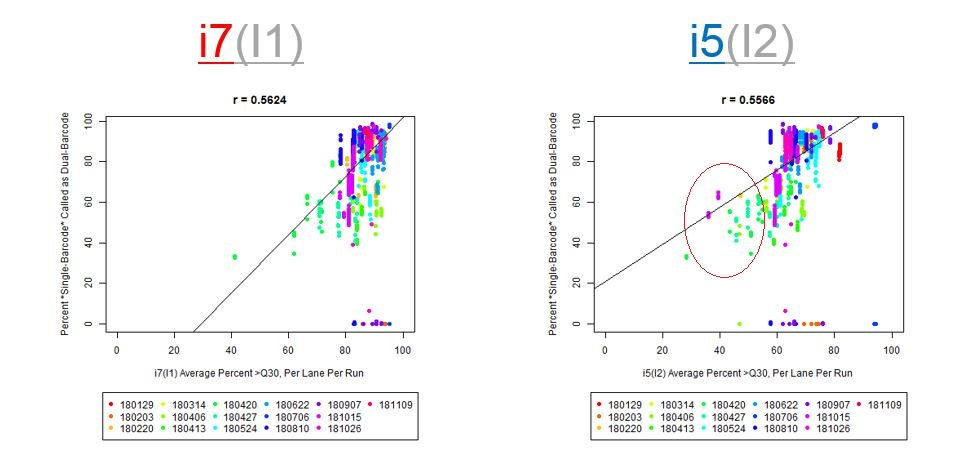
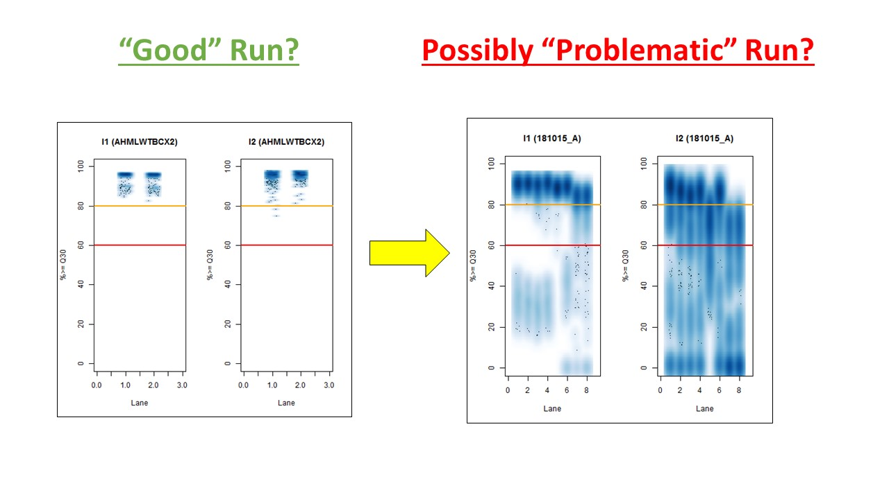

# Testing Calling Single Barcode Samples from Mixed Runs as Dual-Barcode Samples

Please click [here](https://github.com/COHIGC/SingleBarcode-as-DualBarcode/blob/master/cwarden_SingleBarcode_as_DualBarcode_Public.pdf) to view a more detailed summary of results.

This analysis involves a subset of our runs in 2018 with **mixes of different sample types** (such as single-barcode, dual-barcode, and 10X Genomics samples), where we tested calling single-barcode samples as dual-barcode samples.  **We happened to do this for one run, where we noticed 5-15% read loss with the dual-barcodes (I believe Jinhui Wang noticed this).**  Xiwei Wu then asked me to test with more runs (the median read loss was 15%, but you can see the variation per-sample on **slide #7** (on the [PDF](https://github.com/COHIGC/SingleBarcode-as-DualBarcode/blob/master/cwarden_SingleBarcode_as_DualBarcode_Public.pdf), posted on this GitHub Repository).

If we have the correct 2nd barcode (for otherwise single-barcode samples), the I2 quality scores (for the 2nd index, also called i5, see *slide #2*) affect the percent of reads kept for SingleBarcode-as-DualBarcode samples (**slide #8**).  There is some tentative evidence that not having mixed barcode types within the 8 lanes of a HiSeq Regular Run (which is one reason why bcl2fastq has to be run for base calling) can help with the expected read percentages (**slide #19**, versus *slides #16 and #18*).   There is also promising (but limited) evidence that the percent of reads lost in dual-barcode samples matters more for **paired-end (PE)** samples than single-end (SE) samples (**slide #12-14 and #17**).

While some conclusions are hard to make with a limited number of runs, I recommend using these as quality flags for future runs:

**a)**	>40% of samples have **<50% Q30 I2 Reads**
 

 
The Percent >Q30 Values were extracted from the InterOp binary files, after converting them to text files (the plot above is for single-barcode paired-end samples mixed with dual-barcode samples, showing lower I2 Q30 values noticeably decreases the percent of reads called for a single-barcode sample when treated as a dual-barcode sample).  In terms of generating a table with those percent >Q30 values, the most relevant command would be:

```
/path/to/interop/build/src/apps/imaging_table .  > interop_imaging_table.txt
```

In other words, the plot above uses the average values, and the plot below provides examples of why I think showing the distribution of I2 Q30 values may be useful as a QC metric in future runs:  



While the precise metric and plot (see slide #9 versus #10) is a little different for quality flag **a)**, the need to have >Q30 indices was mentioned in [Wright and Vetsigian 2016](https://bmcgenomics.biomedcentral.com/articles/10.1186/s12864-016-3217-x).

**b)** **>50% of samples have less than the required number of reads** (with threshold set below expected number of reads, expecting some loading variability)

**c)** **<200M PF Clusters per lane** (for Regular HiSeq run)

 Per-Lane for HiSeq 2500 Regular Run")

Please note that content almost identical to this README is on [Biostars](https://www.biostars.org/p/376585/). **So, if you have any other similar observations, please leave a comment/answer there!**
